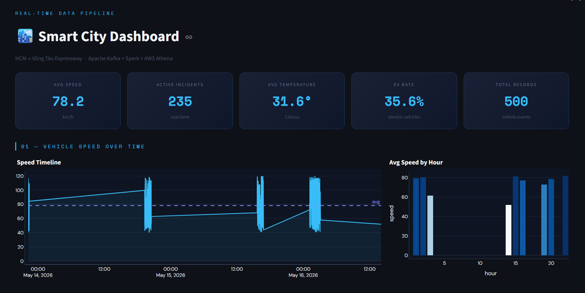
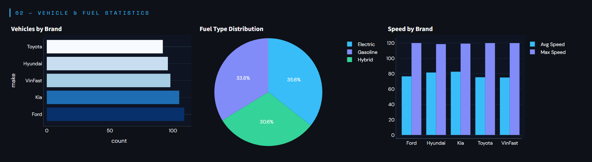
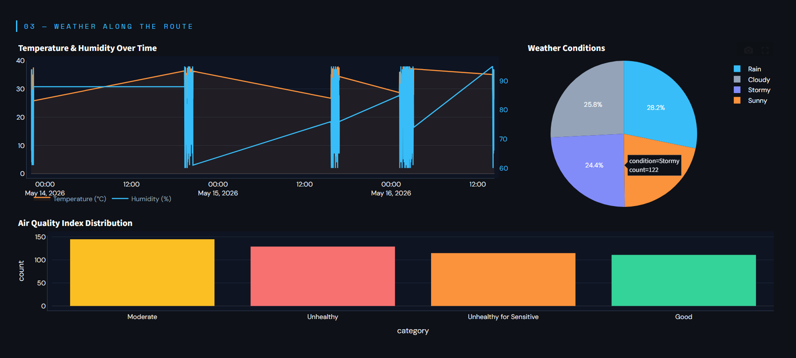
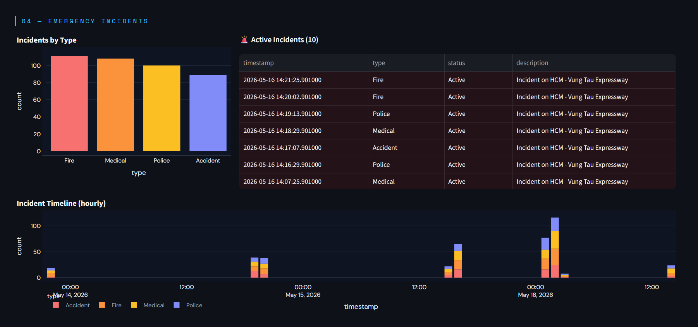

# Smart City Real-Time Data Pipeline

End-to-end real-time data engineering pipeline simulating Smart City IoT vehicle telemetry from Ho Chi Minh City to Vung Tau — streamed through Kafka, processed by Spark, stored on AWS S3, and visualized via Streamlit.

[](https://www.python.org/)
[](https://kafka.apache.org/)
[](https://spark.apache.org/)
[](https://aws.amazon.com/)
[](https://streamlit.io/)

---

## Dashboard Preview






---

## Overview

Production-grade data pipeline that ingests real-time IoT data from 5 sources, processes and enriches it with Spark Structured Streaming, stores Parquet files in AWS S3, catalogs via Athena, and visualizes through an interactive Streamlit dashboard.

**Key Features:**
- Real-time ingestion from 5 IoT data streams (vehicle, GPS, traffic, weather, emergency)
- Event-driven architecture with Apache Kafka
- Distributed stream processing with Apache Spark
- Cloud-native data lake on AWS S3 with Parquet + SNAPPY compression
- Serverless SQL analytics via AWS Athena
- Interactive dashboard built with Streamlit + Plotly

---

## Architecture

```
IoT Simulator → Kafka → Spark Streaming → S3 (raw/)
                                              ↓
                                    transform_parquet.py
                                              ↓
                                        S3 (refined/)
                                              ↓
                               Athena (smartcity_db) → Streamlit Dashboard
```

**Components:**

| Layer | Tool |
|---|---|
| Ingestion | Apache Kafka + Zookeeper (Docker) |
| Stream Processing | Apache Spark 3.5.1 (1 master + 2 workers) |
| Storage | AWS S3 (data lake, Parquet/SNAPPY) |
| Transformation | PySpark — dedup, parse lat/lon, enrich |
| Catalog & Query | AWS Athena (serverless SQL) |
| Visualization | Streamlit + Plotly |

---

## Tech Stack

| Layer | Technology | Version |
|---|---|---|
| Language | Python | 3.13 |
| Message Broker | Apache Kafka | 7.4.0 |
| Stream Processing | Apache Spark | 3.5.1 |
| Containerization | Docker Compose | v3.8 |
| Cloud Storage | AWS S3 | — |
| SQL Analytics | AWS Athena | — |
| Data Catalog | AWS Glue (boto3) | — |
| Visualization | Streamlit + Plotly | 1.57 / 6.7 |
| Data Format | Parquet + SNAPPY | — |

---

## Project Structure

```
smartcity-data-pipeline/
├── dashboard.py                    # Streamlit dashboard (Athena → Plotly)
├── requirements.txt                # Python dependencies
├── env.example                     # Environment variable template
├── Makefile                        # Common commands
├── LICENSE
├── README.md
├── .gitignore
├── docker/
│   ├── docker-compose.yml          # Kafka + Zookeeper + Spark cluster
│   ├── Dockerfile.spark            # Custom Spark image with JARs
│   └── jobs/                       # Mounted into Spark containers
├── docs/                           # Screenshots
│   ├── dashboard-overview.png
│   ├── dashboard-vehicle-fuel.png
│   ├── dashboard-weather.png
│   └── dashboard-emergency.png
├── infrastructure/                 # IaC / AWS setup scripts
├── jobs/
│   ├── config.py                   # AWS + Kafka config loader
│   ├── create_athena_tables.py     # Glue DB + 5 external tables + MSCK REPAIR
│   ├── .env                        # Environment variables (git-ignored)
│   ├── ingestion/
│   │   └── iot_simulator.py        # IoT data producer → 5 Kafka topics
│   ├── streaming/
│   │   └── spark_city.py           # Spark Structured Streaming → S3 Parquet
│   └── transformations/
│       └── transform_parquet.py    # raw/ → refined/ (dedup, enrich, partition)
├── queries/
│   ├── vehicle_stats.sql           # Vehicle & speed analytics
│   └── emergency_events.sql        # Emergency incident analytics
├── scripts/
│   ├── deploy.sh
│   ├── run_pipeline.sh
│   └── setup_aws.sh
└── tests/
    ├── test_simulator.py
    └── test_spark_jobs.py
```

---

## Data Schema

### Vehicle Data
```json
{
  "id": "uuid",
  "vehicle_id": "Vehicle-HCM-VT-001",
  "timestamp": "2026-05-16T14:18:00",
  "location": [10.7769, 106.7009],
  "speed": 78.2,
  "direction": "South-East",
  "make": "VinFast",
  "model": "VF8",
  "year": 2024,
  "fuelType": "Electric"
}
```

Schemas: Vehicle · GPS · Traffic Camera · Weather · Emergency Incident — 5 topics total.

---

## Quick Start

### Prerequisites
- Docker Desktop
- Python 3.10+
- AWS Account with S3 + Athena access

### 1. Clone & Install

```bash
git clone https://github.com/minnobug/smartcity-data-pipeline.git
cd smartcity-data-pipeline
pip install -r requirements.txt
```

### 2. Configure Environment

Create `jobs/.env`:
```bash
AWS_ACCESS_KEY=your_access_key
AWS_SECRET_KEY=your_secret_key
AWS_REGION=ap-southeast-1
AWS_BUCKET_NAME=your-bucket-name

KAFKA_BOOTSTRAP_SERVERS=broker:29092
VEHICLE_TOPIC=vehicle_data
GPS_TOPIC=gps_data
TRAFFIC_TOPIC=traffic_data
WEATHER_TOPIC=weather_data
EMERGENCY_TOPIC=emergency_data
```

### 3. Start Infrastructure

```bash
docker-compose up -d
```

### 4. Create Kafka Topics

```bash
docker exec -it broker bash
kafka-topics --create --topic vehicle_data --bootstrap-server broker:29092 --partitions 1 --replication-factor 1
kafka-topics --create --topic gps_data --bootstrap-server broker:29092 --partitions 1 --replication-factor 1
kafka-topics --create --topic traffic_data --bootstrap-server broker:29092 --partitions 1 --replication-factor 1
kafka-topics --create --topic weather_data --bootstrap-server broker:29092 --partitions 1 --replication-factor 1
kafka-topics --create --topic emergency_data --bootstrap-server broker:29092 --partitions 1 --replication-factor 1
exit
```

### 5. Run Pipeline

```bash
# Terminal 1 — IoT Simulator
python jobs/ingestion/iot_simulator.py

# Terminal 2 — Spark Streaming
docker exec -it spark-master spark-submit \
  --master spark://spark-master:7077 \
  /opt/spark/jobs/streaming/spark_city.py

# Terminal 3 — Transform (after S3 has data)
python jobs/transformations/transform_parquet.py

# Terminal 4 — Create Athena Tables (once)
python jobs/create_athena_tables.py
```

### 6. Launch Dashboard

```bash
pip install streamlit pyathena plotly
streamlit run dashboard.py
```

Open `http://localhost:8501`

---

## Monitoring

| Service | Access |
|---|---|
| Streamlit Dashboard | http://localhost:8501 |
| Spark UI | http://localhost:9090 |
| Kafka logs | `docker logs broker -f` |
| Spark logs | `docker logs spark-master -f` |
| Kafka Broker | Port 29092 (internal) / 9092 (external) |

---

## Athena Queries

After setup, query directly in [AWS Athena Console](https://ap-southeast-1.console.aws.amazon.com/athena):

```sql
-- Average speed by brand
SELECT make, ROUND(AVG(speed), 1) AS avg_speed, COUNT(*) AS trips
FROM smartcity_db.vehicle_data
GROUP BY make ORDER BY avg_speed DESC;

-- Active emergency incidents
SELECT type, status, timestamp, description
FROM smartcity_db.emergency_data
WHERE status = 'Active' AND type != 'None'
ORDER BY timestamp DESC;
```

See full queries in `queries/vehicle_stats.sql` and `queries/emergency_events.sql`.

---

## Troubleshooting

| Issue | Solution |
|---|---|
| Kafka connection refused | `docker ps` — ensure all containers are running |
| Topics not found | Run topic creation commands above |
| Spark job fails | `docker logs spark-master -f` |
| Ivy cache error | `rm -rf /home/spark/.ivy2/cache`, re-submit |
| `python-dotenv` missing in container | `docker exec -u root spark-master pip install python-dotenv` |
| Athena bucket uppercase error | Check `AWS_BUCKET_NAME` in `.env` — must be all lowercase |

---

## Performance

- **Throughput:** ~100 messages/second
- **Latency:** <50ms average
- **Streams:** 5 concurrent Kafka topics
- **Storage:** Parquet + SNAPPY — ~70% compression vs raw JSON
- **Query cost:** Athena serverless — 5TB/month free tier

---

## Roadmap

- [x] IoT data simulation (5 topics)
- [x] Kafka streaming + Docker
- [x] Spark Structured Streaming → S3
- [x] Parquet transformation & enrichment
- [x] AWS Athena catalog + SQL analytics
- [x] Streamlit dashboard (4 sections, live Athena data)
- [ ] Automated pipeline orchestration (Airflow)
- [ ] Unit tests coverage
- [ ] CI/CD with GitHub Actions

---

## License

MIT License — see [LICENSE](LICENSE)

---

## Contact

**Project Maintainer:** [Minnobug](https://github.com/minnobug)

[](https://github.com/minnobug)
[](https://www.linkedin.com/in/le-van-minh-2129s)